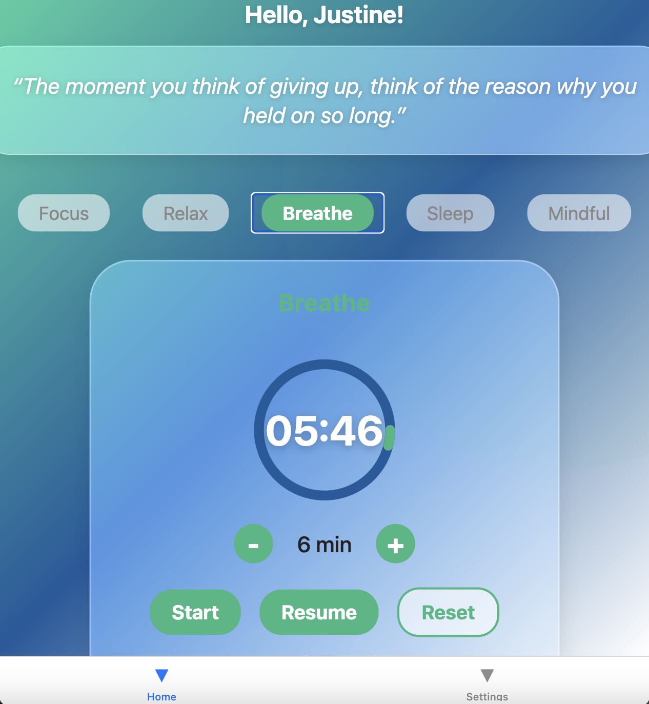
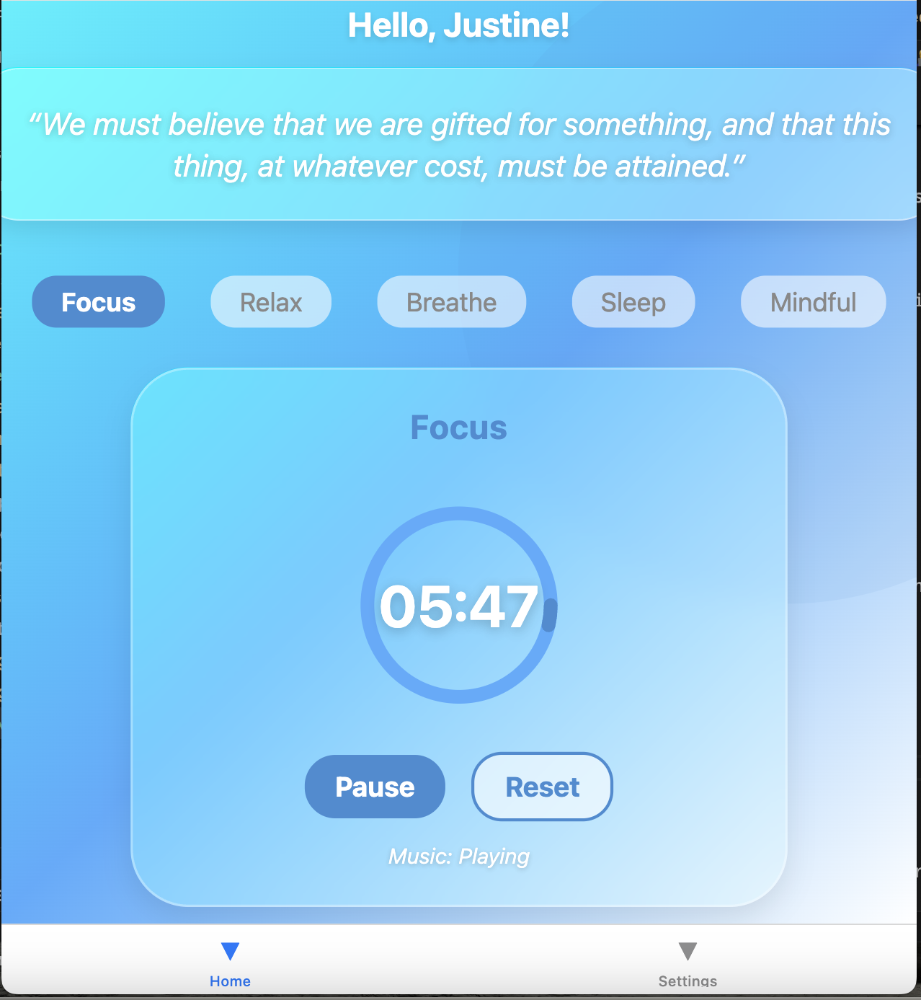
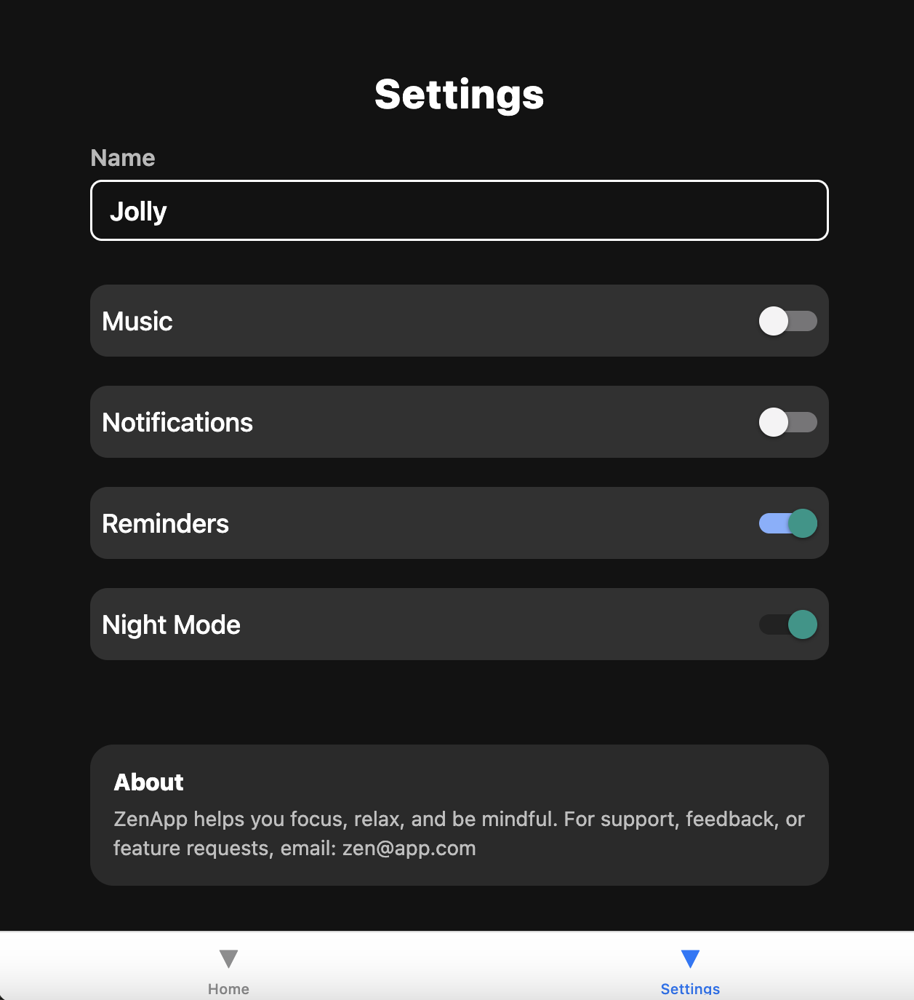

# ZenApp – Minimalist Meditation Mobile App  
_By JustJolly4 (Final Project – React Native)_

ZenApp is a minimalist and aesthetically designed meditation app created with **React Native**. It offers a focused and relaxing experience with a customizable timer, calming background audio, themed visuals, and daily inspirational quotes. The project demonstrates key skills learned throughout the course, including mobile UI design, API integration, persistent state management, and component-based architecture.

---

## 🎯 Project Purpose

The goal of ZenApp is to help users practice mindfulness and reduce stress in a simple and intuitive way. Designed with a clean interface and minimal distractions, the app makes meditation approachable for users of all experience levels.

This app was built as a final course project to showcase a working mobile app that integrates:
- Front-end user interface design with native and custom components
- Backend data access via server APIs
- Persistent local user settings
- React Native development best practices

---

## 📲 Key Features

- **Custom Meditation Timer**  
  Users can set a session duration (1–60 minutes), view a circular progress ring, and control playback with start, pause, resume, and reset options.

- **Background Audio Playback**  
  Each meditation mode includes unique calming music streamed using `expo-av`. Audio playback respects user settings and pauses when the timer stops.

- **Theme Selection**  
  Users can switch between five visual themes (Focus, Relax, Breathe, Sleep, Mindful). Themes control background gradients and accent colors.

- **Inspirational Quotes**  
  A new daily quote is fetched using a public REST API and shown on the home screen in a glassmorphic card.

- **Personalized Settings**  
  Includes user name input, music toggle, and Night Mode switch. These preferences are stored and shared across the app using React Context.

- **Polished UI/UX**  
  Uses animated breathing effects, blur backgrounds, gradients, and responsive layouts to create a calm, elegant user interface.

---

## 🧑‍💻 Technologies Used

- **React Native (Expo)**
- **React Context API** (for global theme/user settings)
- **Expo AV** – audio streaming
- **Expo BlurView / LinearGradient** – visual styling
- **Animated API + SVG** – custom circular timer animation
- **Third-Party REST API** – quote integration

---

---

## 📸 Screenshots

### Home Screen


### Session Timer


### Settings Screen



## 🔗 Server API Design and Specification

ZenApp uses a third-party quote API to retrieve one inspirational quote per session.

- **Endpoint:**  
  `GET https://quotes-api-self.vercel.app/quote`

- **Example Response:**
  ```json
  {
    "quote": "Be present in all things and thankful for all things."
  }
